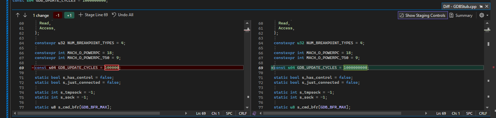

# Getting the GDB Stub Working on Dolphin

There isn't much documentation about Dolphin's GDB Stub so this document aims to help that. GDB Stub is a Dolphin feature that lets users attach a GDB session to a running game. This allows us to debug MKW-SP's at the C/C++ level. Although it is a little finicky, it has great potential to improve the developer experience.

## Setup

- Download [GDB](https://wii.leseratte10.de/devkitPro/devkitPPC/devkitPPC-gdb/). GDB multiarch should also work.
- After downloading, add `powerpc-eabi-gdb to` `PATH`
- Since GDB attaches to a port on localhost, defined by Dolphin, we need to specify a port in `Dolphin.ini`
  - For Window's users `Dolphin.ini` can be found in the Dolphin user folder, in the `Config` folder
  - On Linux (Fedora at least), `Dolphin.ini` can be found in `~/.config/dolphin-emu/Dolphin.ini`
- Add the bellow lines to your `Dolphin.ini`:

```ini
[General] # Don't add this if the General category already exists
GDBPort = {port_num}
```

- We need GDB to be able to read MKW-SP's symbols. To achieve this, run `./build.py --debug`.

## Running in Terminal

- Start MKW-SP. Dolphin will hang because it's waiting for GDB to attach to the port
- Then run the bellow GDB command to attach to the Dolphin instance.
  - `powerpc-eabi-gdb -ex "target remote localhost:{port_num}" .\build\bin\payloadP.elf`

## Running in VSCode

To use GDB in VSCode, add this configuration to `.vscode/launch.json`.

```json
{
  "version": "0.2.0",
  "configurations": [
    {
      "name": "Attach to Dolphin's GDB Stub",
      "type": "cppdbg",
      "request": "launch",
      "program": "${workspaceFolder}/build/bin/payloadP.elf",
      "miDebuggerPath": "powerpc-eabi-gdb",
      "miDebuggerServerAddress": "localhost:{port_num}",
      "cwd": "${workspaceFolder}",
      "stopAtEntry": false,
      "externalConsole": false
    }
  ]
}
```

Start MKW-SP in Dolphin, then run this configuration in VSCode.

## Issues

- Once attached, GDB might cause Dolphin to run very slow. If you encounter this, build Dolphin from source (guide can be found [here](https://github.com/dolphin-emu/dolphin/wiki/Building-for-Windows)). This happens because Dolphin listens for GDB too often, causing a significant IO bottleneck. To fix this, increase the value of `GDB_UPDATE_CYCLES` in `Source/Core/Core/PowerPC/GDBStub.cpp`, causing Dolphin to listen for GDB less often. But don't set it too high, since that could cause Dolphin to not listen for GDB often enough. Here's a screenshot of the change, if helpful 
- On Windows, invalid commands (very annoyingly) crash GDB.
- Communication between Dolphin and GDB is very slow.